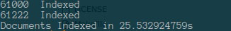

# MONGOES
[](https://goreportcard.com/report/github.com/AdhityaRamadhanus/mongoes)

Set of commandline tools to synchronize mongodb documents and elasticsearch index

<p>
  <a href="#ReadFirst">Read First | </a>
  <a href="#Installation">Installation |</a>
  <a href="#Gondex">Gondex</a> |
  <a href="#Gowatch">Gowatch</a> |
  <a href="#licenses">License</a>
  <br><br>
  <blockquote>
	Set of commandline tools to synchronize mongodb documents and elasticsearch index.
	So you may already have data in mongodb and decided to put them in elasticsearch (You know, for search) or just want to re-sync mongodb with elasticsearch.
  </blockquote>
</p>

Read First
------------
* Everytime you run gondex, it will delete your current index in elasticsearch and create new mapping (and new index ofc)
* These tools only work for elasticsearch v5
* You need to run mongod instance in replicaset to use gowatch

Installation
------------
* git clone
* go get
* make

Gondex
------------
* Gondex will index your mongodb collection to elasticsearch based on a mapping you provide

Usage
------------
```
gondex --config=<filename> --path=<path>
```
* config, Your configuration file (in json)
* path, Path to the config file (if not provided gondex will search current directory)
* Config Example
```
{
    "mongodb": {
        "URI": "localhost:27018",
        "database": "my_db",
        "collection": "todos"
    },
    "elasticsearch": {
        "URI": "http://localhost:9200",
        "index": "my_db",
        "type": "todos"
    },
    "query": {
        "completed": true
    },
	"mapping": {	
		"title": { // take title field in mongodb collection
			"es_type": "string", // will be mapped to string
			"es_index": "not_analyzed"
		},
		"completed": {
			"es_name": "done", // will be mapped to field called done in elasticsearch
			"es_type": "boolean"
		}
	}
}
```




Gowatch 
------------
* Synchronize your mongodb collection with elasticsearch index using mongodb replicaset oplog (insert update delete log)

Usage
------------
```
gowatch --config=<filename> --path=<path>
```
* config, Your configuration file (in json)
* path, Path to the config file (if not provided gondex will search current directory)
* Index and type assumed already have its own mapping, basically gowatch will take field on mongodb documents based on elastic search mapping
* Config Example
```
{
    "mongodb": {
        "URI": "localhost:27018",
        "database": "my_db",
        "collection": "todos"
    },
    "elasticsearch": {
        "URI": "http://localhost:9200",
        "index": "my_db",
        "type": "todos"
    }
}
```

License
----

MIT © [Adhitya Ramadhanus]

